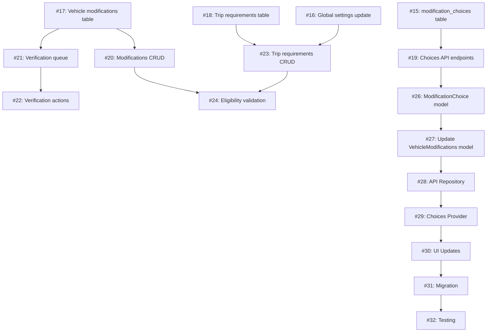

# Vehicle Modifications System - GitHub Issues Summary

**Created:** November 16, 2024  
**Feature Request Date:** November 11, 2025  
**Total Issues Created:** 18 (Backend: 11, Flutter: 7)

---

## 📊 Issues Overview

### Backend Issues (11 issues)

| Issue # | Title | Priority | Time Estimate |
|---------|-------|----------|---------------|
| #15 | Create modification_choices database table and seed initial data | Critical | 2-3 hours |
| #16 | Add min_level_for_requirements to global_settings table | High | 1 hour |
| #17 | Create vehicle_modifications table with permission-based fields | Critical | 2 hours |
| #18 | Create trip_vehicle_requirements table | High | 1-2 hours |
| #19 | Implement /api/choices/ endpoints for all modification types | Critical | 3-4 hours |
| #20 | Implement vehicle modifications CRUD endpoints | Critical | 4-5 hours |
| #21 | Implement verification queue endpoint | High | 2-3 hours |
| #22 | Implement modification verification (approve/reject) endpoint | High | 3-4 hours |
| #23 | Implement trip requirements CRUD endpoints | Critical | 4-5 hours |
| #24 | Implement eligibility checking and registration validation endpoints | High | 3-4 hours |
| #25 | Create permissions for vehicle modifications system | Medium | 1-2 hours |

**Backend Total Time Estimate:** 26-36 hours

---

### Flutter Issues (7 issues)

| Issue # | Title | Priority | Time Estimate |
|---------|-------|----------|---------------|
| #26 | Create ModificationChoice model | Critical | 1-2 hours |
| #27 | Update VehicleModifications model (enums → strings) | Critical | 2-3 hours |
| #28 | Create VehicleModificationsApiRepository | Critical | 4-5 hours |
| #29 | Create ModificationChoicesProvider (Riverpod) | High | 2-3 hours |
| #30 | Update UI components to use dynamic choices | High | 3-4 hours |
| #31 | Migrate from cache service to API repository | High | 2-3 hours |
| #32 | Write comprehensive tests for vehicle modifications | Medium | 4-6 hours |

**Flutter Total Time Estimate:** 18-26 hours

---

## 🎯 Implementation Roadmap

### Phase 1: Foundation (Week 1)
**Backend Focus:**
- #15: Create modification_choices table ⭐
- #16: Update global_settings table ⭐
- #17: Create vehicle_modifications table ⭐
- #18: Create trip_vehicle_requirements table ⭐
- #19: Implement choices API endpoints ⭐

**Flutter Focus:**
- #26: Create ModificationChoice model ⭐
- #27: Update VehicleModifications model ⭐

**Deliverable:** Database schema + Choices API + Updated models

---

### Phase 2: Core API (Week 2)
**Backend Focus:**
- #20: Vehicle modifications CRUD endpoints ⭐
- #21: Verification queue endpoint ⭐
- #22: Verification approve/reject endpoint ⭐
- #23: Trip requirements CRUD endpoints ⭐
- #24: Eligibility validation endpoints ⭐
- #25: Permissions setup

**Flutter Focus:**
- #28: Create API repository ⭐

**Deliverable:** Complete backend API + Flutter API integration

---

### Phase 3: UI & State Management (Week 3)
**Flutter Focus:**
- #29: Create choices provider ⭐
- #30: Update UI components ⭐
- #31: Migrate from cache to API ⭐

**Deliverable:** Production-ready Flutter implementation

---

### Phase 4: Testing & Rollout (Week 4)
**Flutter Focus:**
- #32: Comprehensive testing ⭐

**Integration Testing:**
- End-to-end flow testing
- Backend + Flutter integration
- Performance testing
- Beta release preparation

**Deliverable:** Fully tested system ready for production

---

## 📋 Issue Dependencies



---

## 🔑 Critical Path Issues (Must Complete First)

1. **#15** - modification_choices table (blocks all choices API)
2. **#19** - Choices API endpoints (blocks Flutter dynamic choices)
3. **#17** - vehicle_modifications table (blocks all CRUD endpoints)
4. **#26** - ModificationChoice model (blocks Flutter implementation)
5. **#27** - Update VehicleModifications model (blocks API integration)
6. **#28** - API Repository (blocks UI updates)

**Critical Path Total:** ~17-22 hours

---

## ✅ Acceptance Criteria Summary

### Backend Completion Criteria
- [ ] All database tables created and seeded
- [ ] All API endpoints implemented
- [ ] Permission system configured
- [ ] API documentation complete
- [ ] Unit tests passing
- [ ] Postman/Swagger collection updated

### Flutter Completion Criteria
- [ ] All models updated for dynamic choices
- [ ] API repository fully functional
- [ ] Riverpod providers implemented
- [ ] All UI components updated
- [ ] Cache service migrated to API
- [ ] Unit tests > 80% coverage
- [ ] Widget tests passing
- [ ] Integration tests passing

### System Integration Criteria
- [ ] End-to-end flows working (declare → verify → register)
- [ ] Performance benchmarks met
- [ ] Error handling comprehensive
- [ ] Offline support functional
- [ ] Beta testing completed

---

## 📚 Documentation References

All issues reference these key documents:

1. **Backend API Documentation v2.0**
   - Path: `new_features/vehicle_modifications/BACKEND_API_DOCUMENTATION.md`
   - Complete API specifications, database schemas, endpoints

2. **Flutter Implementation Guide v2.0**
   - Path: `new_features/vehicle_modifications/FLUTTER_IMPLEMENTATION_GUIDE.md`
   - Migration strategy, code examples, testing requirements

3. **Flexibility Analysis**
   - Path: `VEHICLE_MODS_FLEXIBILITY_ANALYSIS.md`
   - Original analysis identifying 5 flexibility areas

---

## 🎯 Key Improvements in v2.0

### ✅ Flexibility Enhancements
1. **Dynamic Modification Choices** - Backend-driven options (no app updates needed)
2. **Level-Flexible Requirements** - Configurable via `min_level_for_requirements`
3. **Permission-Based Verification** - Not role-specific (marshal → verifier)
4. **Future-Ready Localization** - `display_name_ar` fields prepared
5. **Backend Validation** - Business rules enforced at API level

### ✅ Technical Improvements
1. **Consistent API Pattern** - Extends existing `/api/choices/` pattern
2. **Backward Compatibility** - Supports old and new field names
3. **Comprehensive Testing** - Unit, widget, and integration tests
4. **Performance Optimization** - Caching strategy for choices
5. **Error Handling** - Graceful degradation and retry logic

---

## 📞 Issue Management

**GitHub Repository:** https://github.com/Hani-AMJ/Ad4x4-Flutter-App

**Issue Numbers:** #15 - #32

**How to Track Progress:**
```bash
# View all vehicle modifications issues
gh issue list --label "Feature" --search "vehicle modifications"

# View critical priority issues
gh issue list --label "Critical Priority"

# View backend issues
gh issue list --search "[Backend]"

# View Flutter issues
gh issue list --search "[Flutter]"
```

---

## 🚀 Getting Started

### For Backend Developers
1. Start with database issues (#15-#18)
2. Implement choices API (#19)
3. Implement CRUD endpoints (#20-#24)
4. Set up permissions (#25)

### For Flutter Developers
1. Start with model updates (#26-#27)
2. Implement API repository (#28)
3. Create state management (#29)
4. Update UI components (#30-#31)
5. Write tests (#32)

---

## 📝 Notes

- All issues include detailed implementation guidelines
- Code examples provided in documentation
- Time estimates are approximate
- Dependencies clearly marked
- Acceptance criteria defined for each issue

---

**Status:** All 18 issues created successfully ✅  
**Next Step:** Begin Phase 1 implementation (database + models)
